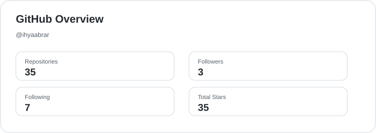
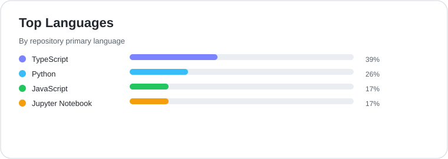
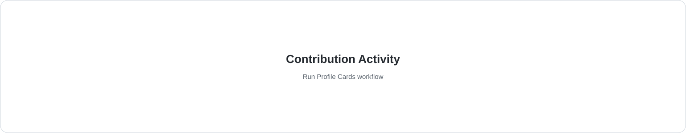
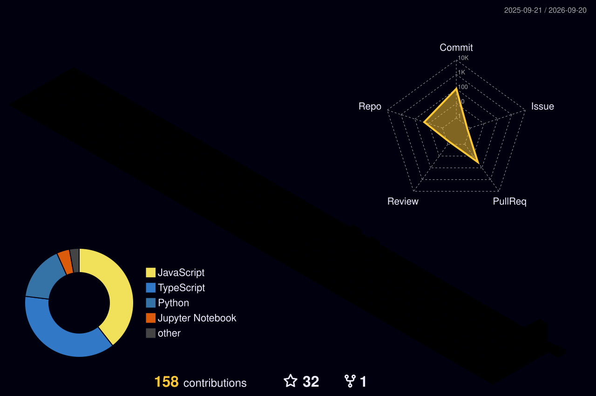

<div align="center">


# Ihya' Nashirudin Abrar

**Mobile Developer · Web Developer · Data Analysis**

<p>
  <a href="https://github.com/ihyaabrar?tab=followers">
    
  </a>
  
  <a href="https://github.com/ihyaabrar?tab=repositories">
    
  </a>
  <a href="https://linkedin.com/in/ihya-nashirudin-abrar-9978a6243">
    
  </a>
</p>

</div>

## 👋 About me

```yaml
name: Ihya' Nashirudin Abrar
roles: [Mobile Developer, Web Developer, Data Analysis]
focus:
  - building useful digital products
  - AI and data experimentation
  - mobile and web development
  - reproducible research
motto: Build • Learn • Experiment • Impact
```

Saya suka membangun sesuatu yang bermanfaat, terus belajar, dan mengembangkan ide menjadi produk yang bisa dipakai
banyak orang. *Build useful things, not just impressive things.*

## 🧰 Tech stack

<div align="center">


`Python` · `TypeScript` · `JavaScript` · `React` · `Next.js` · `Node.js` · `Tailwind` · `FastAPI` · `Prisma` · `Capacitor` · `Docker` · `Git`

</div>

## 🚀 Featured projects

| Project | What it does | Built with |
|---|---|---|
| [**Gerai BKMT**](https://github.com/ihyaabrar/Gerai_BKMT) · [live](https://gerai-bkmt.vercel.app) | Point of sale, inventory, profit sharing and public profile for PD BKMT Kubu Raya | Next.js 14 · Prisma · Tailwind |
| [**MediCode**](https://github.com/ihyaabrar/MediCode) | Browser extension for ICD-10 / ICD-9 lookup and INA-CBG tariff estimates | React · TypeScript · Dexie |
| [**VisionPOS**](https://github.com/ihyaabrar/VisionPOS) | Cashier that recognises products through the camera with YOLO | FastAPI · React · Ultralytics |
| [**Desktop AI Companion**](https://github.com/ihyaabrar/Desktop-AI-Companion) | Local-first desktop companion that remembers you and talks back | Tauri 2 · React · TypeScript |
| [**CertGen**](https://github.com/ihyaabrar/Certificate-Generator) | Bulk certificate generator that runs entirely in the browser | Next.js 15 · Fabric.js · jsPDF |
| [**LLM vs manual preprocessing**](https://github.com/ihyaabrar/llm-vs-manual-preprocessing) | Supplementary notebooks for a medical-claims classification study | Jupyter · scikit-learn · SHAP |

<sub>Also on the bench: an ongoing thesis project on safety-gated checkpoint selection for medical language models —
preregistered, with the code kept private until publication.</sub>

## 📊 GitHub in numbers

<div align="center">

<picture>
  <source media="(prefers-color-scheme: dark)" srcset="./assets/overview.dark.svg"/>
  
</picture>
<picture>
  <source media="(prefers-color-scheme: dark)" srcset="./assets/languages.dark.svg"/>
  
</picture>

<picture>
  <source media="(prefers-color-scheme: dark)" srcset="./assets/contributions.dark.svg"/>
  
</picture>

<sub>Cards are generated inside this repository by a scheduled GitHub Action — no third-party stats service.</sub>

</div>

## 🐍 Contribution graph

<div align="center">

<picture>
  <source media="(prefers-color-scheme: dark)" srcset="./assets/github-snake-dark.svg"/>
  
</picture>



</div>

## 🤝 Connect

<div align="center">

<a href="mailto:ihyakpati1144@gmail.com">
  
</a>
<a href="https://linkedin.com/in/ihya-nashirudin-abrar-9978a6243">
  
</a>
<a href="https://saweria.co/ihyaabrar">
  
</a>

</div>

<div align="center">

> *“Small progress is still progress.”*

Dibuat dengan ❤️ oleh Ihya' Nashirudin Abrar

</div>
