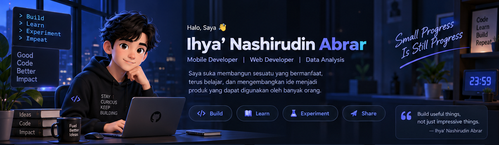

 

Ihya' Nashirudin Abrar

Mobile Developer · Web Developer · Data Analysis

  
  
  

👋 About Me

name: "Ihya' Nashirudin Abrar"
roles:
  - Mobile Developer
  - Web Developer
  - Data Analysis

focus:
  - Building useful digital products
  - AI & data experimentation
  - Mobile & web development
  - Learning new technologies

motto: "Build • Learn • Experiment • Impact"

Saya suka membangun sesuatu yang bermanfaat, terus belajar, dan mengembangkan ide menjadi produk yang dapat digunakan banyak orang.

Build useful things, not just impressive things.

🧰 Tech Stack

  

Python · JavaScript · TypeScript · React · Node.js · HTML · CSS · Git · Docker · MySQL

🚀 Featured Projects

<table>
<tr>
<td width="33%" valign="top">

🧠 PULSAR

LLM Harness & Research App

Eksperimen LLM, research workflow, harness, dan pengembangan aplikasi AI.

AI Research LLM

Explore →

</td>
<td width="33%" valign="top">

🎮 Game Project

2D / 3D Game Development

Eksplorasi gameplay, game systems, interface, dan pengalaman visual.

Game Dev UI/UX Design

Explore →

</td>
<td width="33%" valign="top">

🕌 BKMT Website

Web Application & UI/UX

Pengembangan aplikasi web dengan fokus pada tampilan modern dan pengalaman pengguna.

Web UI/UX Product

Explore →

</td>
</tr>
</table>

🌱 Currently Working On

<table>
<tr>
<td width="50%" valign="top">

🔬 Research & Experiment

🤖 AI & LLM experiments

📊 Data analysis

🧪 Research workflows

🧠 Intelligent application concepts

</td>
<td width="50%" valign="top">

🛠️ Build & Create

📱 Mobile applications

🌐 Web applications

🎮 Game development

✨ UI/UX exploration

</td>
</tr>
</table>

🐍 Contribution Snake

<!-- Generated by .github/workflows/snake.yml -->

<picture>
  <source media="(prefers-color-scheme: dark)" srcset="./assets/github-snake-dark.svg">
  <source media="(prefers-color-scheme: light)" srcset="./assets/github-snake.svg">
  
</picture>

🤝 Connect With Me

❤️ Support Me

Jika project saya bermanfaat dan kamu ingin mendukung pengembangannya:

  

  

Terima kasih atas dukungannya! 🙏

“Small progress is still progress.”

Let's build a better tomorrow, together.

 

Dibuat dengan ❤️ oleh Ihya' Nashirudin Abrar

