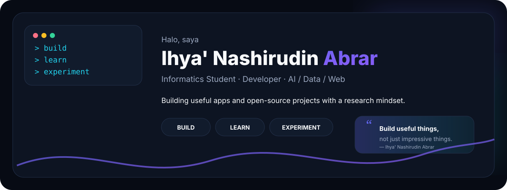
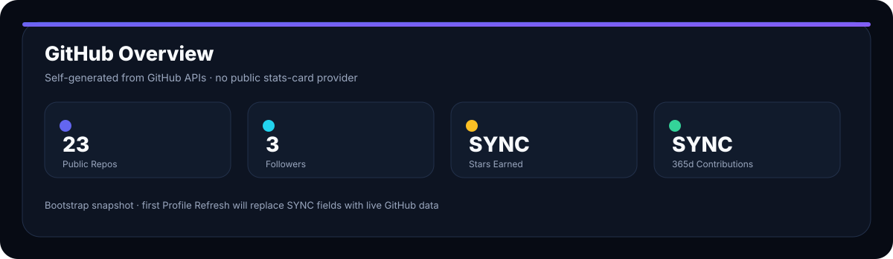
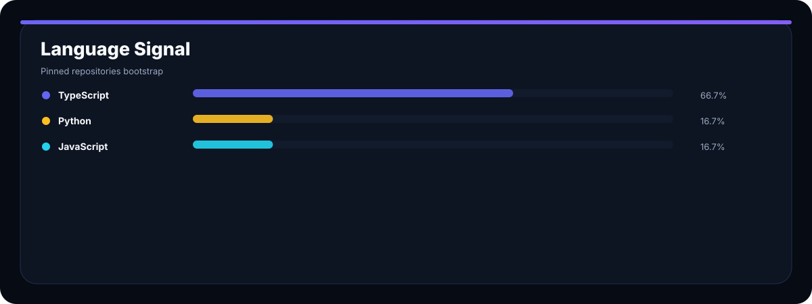
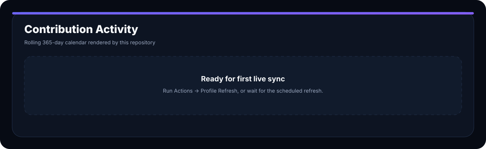
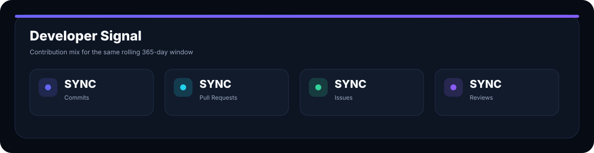
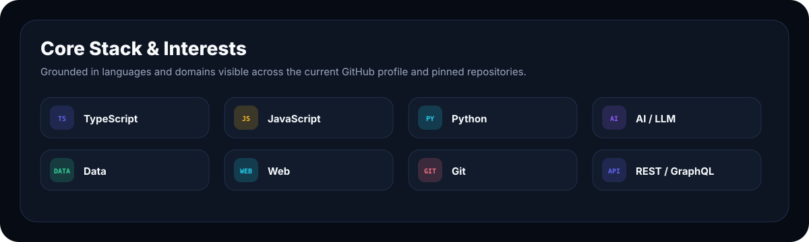
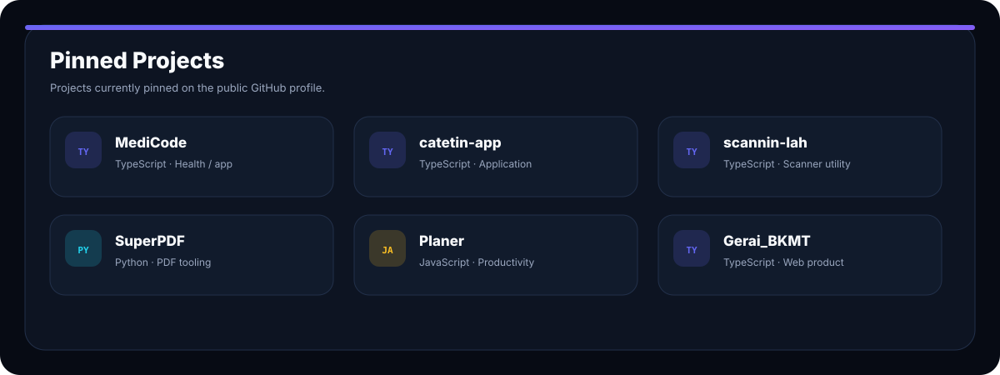
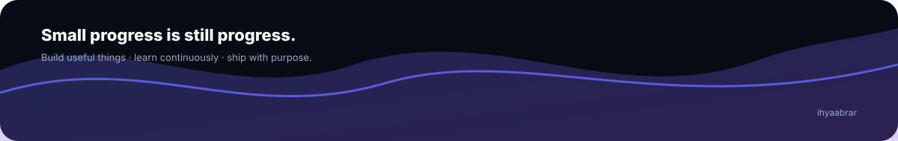

<div align="center">

<picture>
  <source media="(prefers-color-scheme: dark)" srcset="./assets/static/hero-dark.svg">
  <source media="(prefers-color-scheme: light)" srcset="./assets/static/hero-light.svg">
  
</picture>

<br/>

**[GitHub](https://github.com/ihyaabrar)** · **[LinkedIn](https://linkedin.com/in/ihya-nashirudin-abrar-9978a6243)** · **[Instagram](https://instagram.com/ihyaabrar)** · **[Website](https://gerai-bkmt.vercel.app/)** · **[Email](mailto:ihyakpati1144@gmail.com)**

</div>

---

## 👋 About Me

Saya **Ihya' Nashirudin Abrar** — mahasiswa Informatika dan developer dari Indonesia yang tertarik pada **AI, data, web development, serta open-source software**.

Saya suka membangun aplikasi yang berguna, mengeksplorasi ide melalui eksperimen, dan mengubah hasil belajar menjadi produk yang dapat digunakan orang lain.

<table>
<tr>
<td width="50%" valign="top">

### Current focus

- 🤖 AI & intelligent applications
- 📊 Data analysis & experimentation
- 🌐 Web application development
- 🧩 Open-source projects & developer tools

</td>
<td width="50%" valign="top">

### Profile

- 🎓 Informatics Student
- 💻 Developer
- 📍 Indonesia
- 🏢 PT. Dimentorin Aja

</td>
</tr>
</table>

```text
build → learn → experiment → improve → repeat
```

---

## 📊 GitHub Dashboard

> Dashboard ini **dibuat sendiri dari GitHub REST + GraphQL API** dan disimpan sebagai SVG di repository ini. Tidak bergantung pada layanan stats-card publik pihak ketiga.

<table>
<tr>
<td width="50%" valign="top">

<picture>
  <source media="(prefers-color-scheme: dark)" srcset="./assets/generated/overview-dark.svg">
  <source media="(prefers-color-scheme: light)" srcset="./assets/generated/overview-light.svg">
  
</picture>

</td>
<td width="50%" valign="top">

<picture>
  <source media="(prefers-color-scheme: dark)" srcset="./assets/generated/languages-dark.svg">
  <source media="(prefers-color-scheme: light)" srcset="./assets/generated/languages-light.svg">
  
</picture>

</td>
</tr>
</table>

<picture>
  <source media="(prefers-color-scheme: dark)" srcset="./assets/generated/contributions-dark.svg">
  <source media="(prefers-color-scheme: light)" srcset="./assets/generated/contributions-light.svg">
  
</picture>

<br/>

<picture>
  <source media="(prefers-color-scheme: dark)" srcset="./assets/generated/signal-dark.svg">
  <source media="(prefers-color-scheme: light)" srcset="./assets/generated/signal-light.svg">
  
</picture>

---

## 🧰 Tech Stack & Interests

<picture>
  <source media="(prefers-color-scheme: dark)" srcset="./assets/static/stack-dark.svg">
  <source media="(prefers-color-scheme: light)" srcset="./assets/static/stack-light.svg">
  
</picture>

**Core languages:** TypeScript · JavaScript · Python  
**Domains:** AI / LLM · Data · Web  
**Workflow:** Git · GitHub · REST / GraphQL APIs

---

## 🚀 Featured Projects

<picture>
  <source media="(prefers-color-scheme: dark)" srcset="./assets/static/projects-dark.svg">
  <source media="(prefers-color-scheme: light)" srcset="./assets/static/projects-light.svg">
  
</picture>

<table>
<tr>
<td width="33%" valign="top">

### 🩺 [MediCode](https://github.com/ihyaabrar/MediCode)
`TypeScript`

</td>
<td width="33%" valign="top">

### 📝 [catetin-app](https://github.com/ihyaabrar/catetin-app)
`TypeScript`

</td>
<td width="33%" valign="top">

### 📷 [scannin-lah](https://github.com/ihyaabrar/scannin-lah)
`TypeScript`

</td>
</tr>
<tr>
<td width="33%" valign="top">

### 📄 [SuperPDF](https://github.com/ihyaabrar/SuperPDF)
`Python`

</td>
<td width="33%" valign="top">

### 🗓️ [Planer](https://github.com/ihyaabrar/Planer)
`JavaScript`

</td>
<td width="33%" valign="top">

### 🕌 [Gerai_BKMT](https://github.com/ihyaabrar/Gerai_BKMT)
`TypeScript`

</td>
</tr>
</table>

> Lihat seluruh repository di **[github.com/ihyaabrar?tab=repositories](https://github.com/ihyaabrar?tab=repositories)**.

---

## 🔭 Currently Exploring

- **LLM applications & harnesses** — eksperimen orchestration, evaluation, dan workflow AI.
- **Data-driven software** — aplikasi yang menjadikan data sebagai bagian dari keputusan produk.
- **Modern web products** — interface yang responsif, jelas, dan dapat dipelihara.
- **Open source** — membangun project yang bisa dipelajari, digunakan, dan dikembangkan kembali.

---

## 🤝 Connect

<div align="center">

**[Email](mailto:ihyakpati1144@gmail.com)** · **[LinkedIn](https://linkedin.com/in/ihya-nashirudin-abrar-9978a6243)** · **[GitHub](https://github.com/ihyaabrar)** · **[Instagram](https://instagram.com/ihyaabrar)**

<br/>

Kalau project saya bermanfaat dan kamu ingin mendukung pengembangannya:  
☕ **[Traktir kopi via Saweria](https://saweria.co/ihyaabrar)**

</div>

<br/>

<picture>
  <source media="(prefers-color-scheme: dark)" srcset="./assets/static/footer-dark.svg">
  <source media="(prefers-color-scheme: light)" srcset="./assets/static/footer-light.svg">
  
</picture>

<div align="center">

Built with purpose by **Ihya' Nashirudin Abrar**.

</div>
